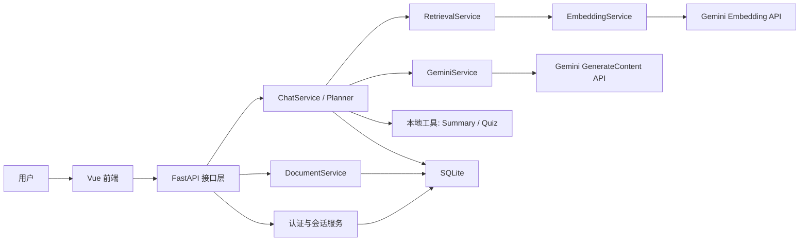
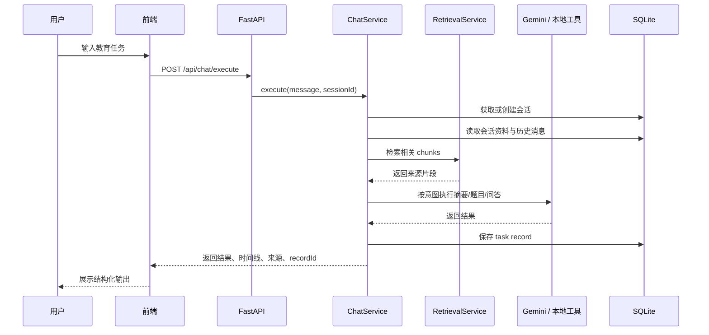

# 最终架构说明

## 1. 架构目标

本项目的目标不是做一个追求复杂度的通用大模型平台，而是交付一个适合课程项目演示的教育助手 AI Agent。架构设计强调四点：

- 教育场景完整：登录、资料上传、总结、出题、资料问答、错题整理
- Agent 流程可解释：展示意图、步骤、状态与来源片段
- 运行链路可控：有 AI 能力时增强，无 AI 能力时仍可回退
- 本地部署简单：前后端分离开发，单机即可跑通完整演示

## 2. 总体架构

## 3. 前端架构

前端位于 `frontend/`，技术栈为 Vue 3 + Vite + TypeScript。

主要模块：

- 路由层：登录页、聊天页、路由守卫
- 状态层：Pinia 管理 token 与用户资料
- API 层：认证、聊天、资料上传、错题与导出接口封装
- 展示层：消息气泡、结果卡片、错误卡片、会话列表、资料列表、错题面板

界面核心分区：

- 左侧边栏：用户状态、会话历史、资料列表、错题本、Agent 阶段
- 主对话区：用户消息、结构化结果、错误结果、资料来源、模板任务入口
- 表单区：任务输入、模板填充、重试、发送

## 4. 后端架构

后端位于 `backend/`，技术栈为 FastAPI + SQLAlchemy + SQLite。

### 4.1 接口层

主要路由：

- `auth.py`：注册、登录、获取当前用户
- `chat.py`：执行任务、会话列表、会话详情、结果导出、错题记录
- `documents.py`：上传资料、获取会话资料
- `health.py`：健康检查

### 4.2 服务层

核心服务：

- `ChatService`
  - 任务主入口
  - 绑定会话
  - 读取资料与最近历史
  - 调用规划器、检索器、AI 服务与本地工具
  - 持久化任务记录
- `SessionService`
  - 创建会话
  - 查询归属会话
  - 更新会话时间
- `DocumentService`
  - 保存上传文件
  - 抽取文档文本
  - 文本分块
  - 持久化资料与 chunk
- `RetrievalService`
  - 追问改写
  - 关键词召回
  - 向量相似度计算
  - rerank 与上下文拼接
- `GeminiService`
  - 摘要
  - 题目生成
  - 基于资料问答
- `EmbeddingService`
  - Gemini 向量嵌入
  - 查询向量与文档向量余弦相似度
- `ExportService`
  - Markdown 结果导出
- `MistakeService`
  - 作答结果比对
  - 错题持久化
  - 错题列表返回

## 5. 数据模型

主要表：

- `users`
  - 用户基本信息与密码哈希
- `chat_sessions`
  - 会话主表
- `task_records`
  - 每次任务的请求、意图、状态、结果、步骤、时间线、检索片段
- `uploaded_documents`
  - 上传资料元信息与抽取文本
- `document_chunks`
  - 文档切块、关键词、嵌入向量
- `mistake_records`
  - 错题记录、用户答案、正确答案、来源摘录

这种建模可以保证：

- 会话可以回放
- 检索上下文可追踪
- 错题可以沉淀
- 演示时能讲清楚“用户任务如何落库与回显”

## 6. Agent 执行流程

## 7. RAG 设计

本项目没有直接上重量级向量数据库，而是采用“课程项目可控实现”：

- 文档上传后先抽取文本并分块
- 每个 chunk 保存关键词与 Gemini 向量
- 查询时同时计算：
  - 关键词重叠分数
  - 向量相似度分数
- 再做一次基于术语覆盖率的 rerank
- 最终把前几个高分 chunk 拼接成上下文

这样做的优点：

- 不引入额外部署成本
- 实现过程足够清晰，适合答辩说明
- 没有 API Key 时还能退化为关键词检索

## 8. 容错与回退策略

项目设计了多层回退，避免因为外部模型能力波动导致系统不可演示：

- 没有 `GEMINI_API_KEY`
  - 不做向量嵌入
  - 检索退化为关键词召回
  - 摘要、题目、问答退化为本地工具或规则输出
- 文档抽取失败
  - 返回可读错误信息
- 非法 token
  - 前端清空登录态并跳转登录页
- 老数据库缺字段
  - 启动时自动补齐 SQLite 表结构

## 9. 适合课程答辩的讲解重点

这个架构最适合强调三件事：

- 不是单纯调用大模型，而是做了 Agent 规划、工具调用、结果整合
- 不是简单聊天，而是支持资料上传、检索增强、资料来源展示与错题沉淀
- 不是只能本地跑，而是具备一键联调、导出结果和临时公网分享能力

## 10. 后续可扩展方向

如果继续迭代到课程之外，可以优先考虑：

- 引入真正的向量数据库
- 加入 chunk 摘要与多路 rerank
- 支持教师端题库管理
- 支持学生答题评分与学习报告
- 把错题本升级为个性化复习计划
